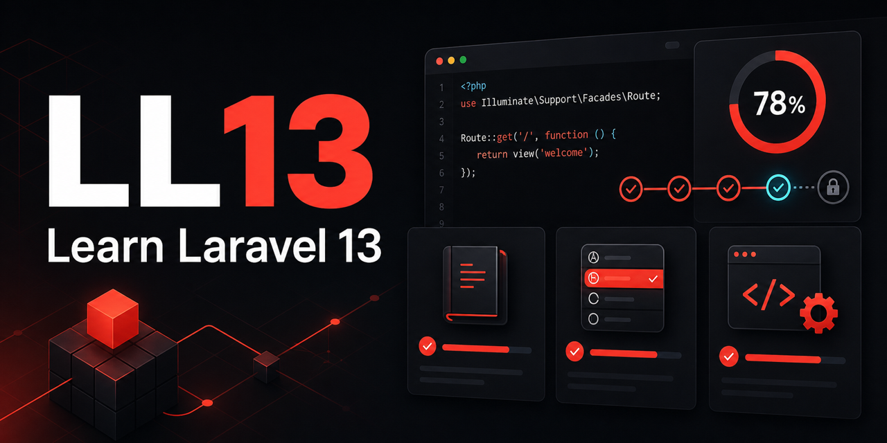

# LL13: Learn Laravel 13



LL13 is an open-source Laravel 13 learning app built to help developers learn by studying, answering, building, and reflecting.

The app combines guided study plans, multiple-choice checkpoints, hands-on tasks, learning logs, confidence tracking, and progress dashboards. It is also meant to be a readable Laravel codebase for people who want to learn how a modern Laravel, Inertia, React, and TypeScript application fits together.

## Why This Exists

Tutorials are useful, but framework fluency comes from repeating the full loop:

1. Study the concept.
2. Answer a focused question.
3. Build a small task.
4. Explain what changed.
5. Track progress over time.

LL13 turns that loop into a small product you can run locally, inspect, extend, and learn from.

## Current Features

- Guided quest catalog with 104 first-batch activities.
- Four built-in learning tracks from PHP foundations to modern Laravel operations.
- Study-first lesson cards before each checkpoint phase.
- Multiple-choice checkpoints with server-side grading.
- Explanations for correct MCQ answers after completion.
- Hands-on implementation tasks that ask learners to build and explain real work.
- Custom learning paths with target dates, confidence scores, and weekly study minutes.
- Learning logs for study sessions and reflections.
- Dashboard metrics for active paths, logged hours, checkpoints, weekly plan, and confidence.
- Laravel authentication, authorization policies, migrations, factories, seed data, and feature tests.

## Built-In Learning Tracks

Each track currently includes 26 activities: 16 MCQs and 10 hands-on tasks.

| Track | Focus |
| --- | --- |
| PHP Foundations Quest | Variables, arrays, functions, classes, Composer, dependency boundaries |
| Laravel Foundations Quest | Routes, controllers, validation, Eloquent, policies, tests |
| Laravel 13 Quest: Basics to Advanced | Inertia, React, forms, authorization, queues, release confidence |
| Modern Laravel Deep Dive Quest | Deployments, caches, workers, concurrency, operations, recovery |

The track structure is inspired by public topic organization from Laracasts Discover. The lessons, questions, explanations, and tasks in this repository are original.

## Screenshots And Social Preview

The GitHub social preview image is stored at:

```text
docs/assets/ll13-social-preview.png
```

Use that image in the GitHub repository social preview settings. It is 1280x640, which matches GitHub's recommended high-resolution preview size.

## Tech Stack

- Laravel 13
- PHP 8.4 recommended, PHP 8.3 minimum per Composer constraints
- Inertia.js 2
- React 19
- TypeScript
- Tailwind CSS 4
- SQLite for local development
- PHPUnit 12

## Requirements

- PHP 8.4 or newer recommended
- Composer 2
- Node.js 22 or newer
- npm
- SQLite

## Installation

Clone the repository and install dependencies:

```bash
git clone git@github.com:NeXsHeLL/LL13.git
cd LL13
composer install
npm install
```

Create the environment file and application key:

```bash
cp .env.example .env
php artisan key:generate
```

Create the SQLite database and run migrations:

```bash
touch database/database.sqlite
php artisan migrate
```

Start the local development stack:

```bash
composer run dev
```

The Laravel development server URL is printed in the terminal, usually `http://127.0.0.1:8000`.

## Demo Data

Create a fresh database with the demo user and sample learning quest:

```bash
php artisan migrate:fresh --seed
```

Default seeded user:

```text
Email: test@example.com
Password: password
```

## Quality Checks

Run the backend test suite:

```bash
php artisan test --compact
```

Format PHP:

```bash
php vendor/bin/pint
```

Check frontend formatting:

```bash
npm run format:check
```

Lint frontend assets:

```bash
npm run lint
```

Build production assets:

```bash
npm run build
```

## Documentation

- [Learning paths](docs/learning-paths.md)
- [Development guide](docs/development.md)
- [Roadmap](docs/roadmap.md)
- [Contributing](CONTRIBUTING.md)
- [Security policy](SECURITY.md)

## Repository Hygiene

This repository intentionally excludes local environment files, installed dependencies, generated build assets, IDE folders, and assistant/tooling metadata. Do not commit `.env`, `vendor`, `node_modules`, `public/build`, local SQLite databases, or agent-specific configuration files.

## License

LL13 is open-sourced software licensed under the MIT license.
